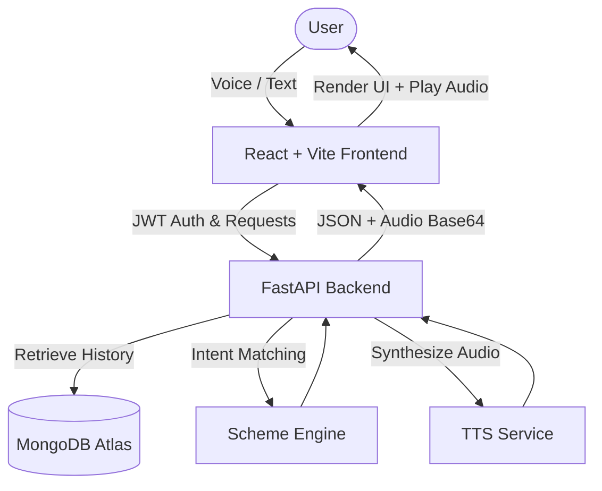

# 🎙️ Voice OS Bharat


> A production-ready, multilingual AI voice assistant designed to simplify access to government schemes across India.

**Voice OS Bharat** empowers users by providing accurate, intent-driven guidance on various government schemes. It seamlessly accepts voice and text inputs, transcribes speech in real-time, classifies user intents, retrieves relevant scheme information, and responds with natural-sounding synthesized audio in multiple regional languages.

---

## ✨ Key Features

- **🗣️ Multilingual Support**: Communicates fluently in English, Hindi, and other regional languages.
- **🎤 Real-time Voice Interaction**: High-quality speech-to-text (STT) and text-to-speech (TTS) pipelines.
- **🧠 Intelligent Intent Classification**: Fast, rule-based and ML-driven intent routing to identify user needs accurately.
- **💾 Persistent Chat History**: Conversations are securely stored and retrieved using MongoDB Atlas.
- **🔒 Secure Authentication**: JWT-based secure user signup and login flows.
- **⚡ Blazing Fast Architecture**: Built on FastAPI and React (Vite) for low-latency interactions.
- **🚀 CI/CD & Cloud Ready**: Fully automated testing and deployment pipelines via GitHub Actions (Render & Vercel).

---

## 🏗️ Architecture



---

## 📂 Project Structure

```text
Voice-os-bhaarat/
├── .github/workflows/    # CI/CD Pipelines (ci.yml, cd.yml)
├── backend/              # FastAPI Application
│   ├── db/               # MongoDB Connection & Models
│   ├── routers/          # API Endpoints (Auth, Audio, Conversations, Health)
│   ├── services/         # Core Logic (TTS, Pipeline)
│   ├── scheme_engine.py  # Intent & Retrieval Engine
│   └── main.py           # Application Entrypoint
├── frontend/             # React Client
│   ├── src/
│   │   ├── components/   # UI Components (Sidebar, VoiceInteraction, etc.)
│   │   ├── pages/        # Application Views (Login, Signup, etc.)
│   │   └── App.tsx       # Root Component
├── datasets/             # Embedded scheme data
└── requirements.txt      # Python dependencies
```

---

## 🚀 Getting Started (Local Development)

### Prerequisites
- **Python 3.10+**
- **Node.js 18+**
- **MongoDB Atlas** account (or local MongoDB instance)

### 1. Backend Setup

1. Navigate to the project root and create a virtual environment:
   ```bash
   python -m venv .venv
   source .venv/bin/activate  # On Windows: .\.venv\Scripts\activate
   ```
2. Install dependencies:
   ```bash
   pip install -r requirements.txt
   ```
3. Set up environment variables. Create a `.env` file in the `backend/` directory:
   ```env
   MONGO_URI=mongodb+srv://<user>:<password>@cluster.mongodb.net/voiceos
   JWT_SECRET=your_super_secret_jwt_key
   ```
4. Start the FastAPI server:
   ```bash
   cd backend
   uvicorn main:app --reload --host 0.0.0.0 --port 8000
   ```

### 2. Frontend Setup

1. Open a new terminal and navigate to the frontend directory:
   ```bash
   cd frontend
   ```
2. Install dependencies:
   ```bash
   npm install
   ```
3. Set up environment variables. Create a `.env` file in the `frontend/` directory:
   ```env
   VITE_API_URL=http://localhost:8000
   ```
4. Start the Vite development server:
   ```bash
   npm run dev
   ```

---

## ☁️ Deployment

This project is fully configured for automated cloud deployments.

### CI/CD Pipeline
- **CI Pipeline**: Automatically runs on every `push` and `pull_request` to the `main` branch. It checks out the code, installs backend/frontend dependencies, runs backend health checks, and builds the frontend.
- **CD Pipeline**: Once CI passes, it automatically triggers a deployment webhook.

### Production Targets
- **Backend**: Configured for deployment on **Render** (via `backend/Procfile` and deployment hooks).
- **Frontend**: Configured for deployment on **Vercel** (zero-config Vite preset).

**Required GitHub Secrets:**
- `MONGO_URI`: Production database connection string.
- `JWT_SECRET`: Production JWT signing key.
- `RENDER_DEPLOY_HOOK`: Render deployment webhook URL.

---

## 📚 API Endpoints

| Method | Endpoint | Description |
|--------|----------|-------------|
| `POST` | `/api/auth/signup` | Register a new user |
| `POST` | `/api/auth/login` | Authenticate and receive JWT |
| `GET`  | `/api/conversations` | Retrieve all chat sessions for the authenticated user |
| `POST` | `/api/process-text` | Process user query, perform intent matching, and return response + TTS audio |
| `GET`  | `/health` | Check backend service health |

---

## 🤝 Contributing

Contributions are welcome! Please feel free to submit a Pull Request.
1. Fork the repository
2. Create your feature branch (`git checkout -b feature/AmazingFeature`)
3. Commit your changes (`git commit -m 'Add some AmazingFeature'`)
4. Push to the branch (`git push origin feature/AmazingFeature`)
5. Open a Pull Request

---

## 📝 License

Distributed under the MIT License. See `LICENSE` for more information.
